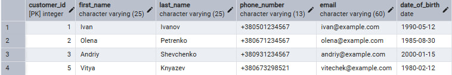
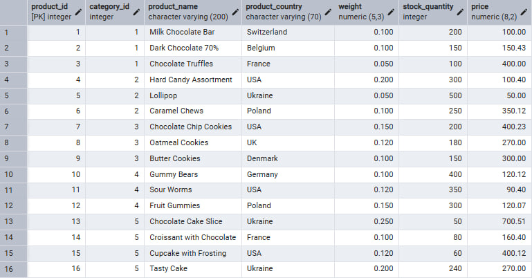

#SELECT, INSERT, UPDATE, DELETE Operations

## **Previous requests:**
/* 
CREATE TYPE payment_type AS ENUM ('card', 'paypal', 'apple_pay', 'google_pay');
CREATE TYPE status AS ENUM ('pending', 'success', 'failed', 'refunded');
CREATE TYPE delivery AS ENUM ('nova_poshta', 'ukr_poshta', 'meest');

CREATE TABLE customer (
customer_id SERIAL PRIMARY KEY,
first_name VARCHAR(25) NOT NULL,
last_name VARCHAR(25) NOT NULL,
phone_number VARCHAR(13) NOT NULL UNIQUE,
email VARCHAR(60) NOT NULL UNIQUE,
date_of_birth DATE NOT NULL CHECK(date_of_birth BETWEEN '1925-01-01' AND '2025-01-01')
);

CREATE TABLE address (
address_id SERIAL PRIMARY KEY,
customer_id INT NOT NULL,
country VARCHAR(70) NOT NULL,
city VARCHAR(200) NOT NULL,
address_line VARCHAR(400) NOT NULL,
address_is_default BOOL NOT NULL DEFAULT FALSE,
FOREIGN KEY (customer_id) REFERENCES customer(customer_id)
);

CREATE TABLE category (
category_id SERIAL PRIMARY KEY,
category_name VARCHAR(30) NOT NULL
);

CREATE TABLE product (
product_id SERIAL PRIMARY KEY,
category_id INTEGER NOT NULL,
product_name VARCHAR(200) NOT NULL,
product_country VARCHAR(70) NOT NULL,
weight NUMERIC(5,3) NOT NULL CHECK (weight > 0),
stock_quantity INTEGER NOT NULL,
price NUMERIC(8,2) NOT NULL CHECK (price > 0),
FOREIGN KEY (category_id) REFERENCES category(category_id)
);

CREATE TABLE cart (
cart_id SERIAL PRIMARY KEY,
customer_id INTEGER NOT NULL,
total_price NUMERIC(8,2) NOT NULL DEFAULT 0,
FOREIGN KEY (customer_id) REFERENCES customer(customer_id)
);

CREATE TABLE cart_item (
cart_id INTEGER NOT NULL,
product_id INTEGER NOT NULL,
PRIMARY KEY (cart_id, product_id),
unit_price NUMERIC(8,2) NOT NULL CHECK(unit_price > 0),
quantity INTEGER NOT NULL CHECK(quantity > 0),
total_item_price NUMERIC(9,2) GENERATED ALWAYS AS (unit_price * quantity) STORED,
FOREIGN KEY (cart_id) REFERENCES cart(cart_id),
FOREIGN KEY (product_id) REFERENCES product(product_id)
);

CREATE TABLE order_table (
order_id SERIAL PRIMARY KEY,
customer_id INTEGER NOT NULL,
address_id INTEGER NOT NULL,
recipient_first_name VARCHAR(25) NOT NULL,
recipient_last_name VARCHAR(25) NOT NULL,
customer_is_recipient BOOL NOT NULL DEFAULT FALSE,
delivery_type delivery NOT NULL DEFAULT 'nova_poshta',
order_date DATE NOT NULL DEFAULT CURRENT_DATE,
order_status status NOT NULL DEFAULT 'pending',
total_price NUMERIC(9,2) NOT NULL CHECK(total_price > 0),
FOREIGN KEY (customer_id) REFERENCES customer(customer_id),
FOREIGN KEY (address_id) REFERENCES address(address_id)
);

CREATE TABLE order_item (
order_id INTEGER NOT NULL,
product_id INTEGER NOT NULL,
PRIMARY KEY (order_id, product_id),
unit_price NUMERIC(8,2) NOT NULL CHECK (unit_price > 0),
quantity INTEGER NOT NULL CHECK (quantity > 0),
total_item_price NUMERIC(9,2) GENERATED ALWAYS AS (unit_price * quantity) STORED,
FOREIGN KEY (order_id) REFERENCES order_table(order_id),
FOREIGN KEY (product_id) REFERENCES product(product_id)
);

CREATE TABLE payment (
payment_id SERIAL PRIMARY KEY,
order_id INTEGER NOT NULL,
payment_method payment_type NOT NULL,
payment_date DATE NOT NULL,
payment_status status NOT NULL,
amount NUMERIC(9,2) NOT NULL CHECK (amount > 0),
transaction_id VARCHAR(400) NOT NULL,
FOREIGN KEY (order_id) REFERENCES order_table(order_id)
);

CREATE TABLE review (
review_id SERIAL PRIMARY KEY,
customer_id INTEGER NOT NULL,
product_id INTEGER NOT NULL,
review_comment VARCHAR(350) NOT NULL,
rating INTEGER NOT NULL CHECK (rating BETWEEN 1 AND 10),
review_date DATE NOT NULL DEFAULT CURRENT_DATE,
FOREIGN KEY (customer_id) REFERENCES customer(customer_id),
FOREIGN KEY (product_id) REFERENCES product(product_id)
);

INSERT INTO customer (first_name, last_name, phone_number, email, date_of_birth)
VALUES
('Ivan', 'Ivanov', '+380501234567', 'ivan@example.com', '1990-05-12'),
('Olena', 'Petrenko', '+380671234567', 'olena@example.com', '1985-08-30'),
('Andriy', 'Shevchenko', '+380931234567', 'andriy@example.com', '2000-01-15');

INSERT INTO address (customer_id, country, city, address_line, address_is_default)
VALUES
(1, 'Ukraine', 'Kyiv', 'Khreshchatyk 1', TRUE),
(2, 'Ukraine', 'Lviv', 'Svobody Ave 10', TRUE),
(3, 'Ukraine', 'Odessa', 'Deribasivska 5', TRUE);

INSERT INTO category (category_name)
VALUES
('Chocolate'),
('Candy'),
('Cookies'),
('Gummies'),
('Cake & Pastry');

INSERT INTO product (category_id, product_name, product_country, weight, stock_quantity, price)
VALUES
-- Chocolate
(1, 'Milk Chocolate Bar', 'Switzerland', 0.100, 200, 100.00),
(1, 'Dark Chocolate 70%', 'Belgium', 0.100, 150, 150.43),
(1, 'Chocolate Truffles', 'France', 0.050, 100, 400.00),

-- Candy
(2, 'Hard Candy Assortment', 'USA', 0.200, 300, 600.00),
(2, 'Lollipop', 'Ukraine', 0.050, 500, 50.00),
(2, 'Caramel Chews', 'Poland', 0.100, 250, 350.12),

-- Cookies
(3, 'Chocolate Chip Cookies', 'USA', 0.150, 200, 150.24),
(3, 'Oatmeal Cookies', 'UK', 0.120, 180, 270.00),
(3, 'Butter Cookies', 'Denmark', 0.100, 150, 300.00),

-- Gummies
(4, 'Gummy Bears', 'Germany', 0.100, 400, 120.12),
(4, 'Sour Worms', 'USA', 0.120, 350, 90.40),
(4, 'Fruit Gummies', 'Poland', 0.150, 300, 120.07),

-- Cake & Pastry
(5, 'Chocolate Cake Slice', 'Ukraine', 0.250, 50, 700.51),
(5, 'Croissant with Chocolate', 'France', 0.100, 80, 160.40),
(5, 'Cupcake with Frosting', 'USA', 0.120, 60, 400.12);

INSERT INTO cart (customer_id, total_price)
VALUES
(1, 0),
(2, 0),
(3, 0);

INSERT INTO cart_item (cart_id, product_id, unit_price, quantity)
VALUES
(1, 1, 140.05, 2),   -- Milk Chocolate Bar
(1, 7, 180.24, 3),   -- Chocolate Chip Cookies

(2, 4, 645.00, 1),   -- Hard Candy Assortment
(2, 13, 780.51, 1),  -- Chocolate Cake Slice

(3, 15, 440.12, 2),  -- Cupcake with Frosting
(3, 10, 120.40, 5);   -- Sour Worms

INSERT INTO order_table (customer_id, address_id, recipient_first_name, recipient_last_name, customer_is_recipient, delivery_type, order_status, total_price)
VALUES
(1, 1, 'Ivan', 'Ivanov', TRUE, 'nova_poshta', 'pending', 820.82),
(2, 2, 'Olena', 'Petrenko', TRUE, 'ukr_poshta', 'pending', 1425.51),
(3, 3, 'Andriy', 'Shevchenko', TRUE, 'meest', 'pending', 1482.24);

INSERT INTO order_item (order_id, product_id, unit_price, quantity)
VALUES
(1, 1, 140.05, 2),  
(1, 7, 180.24, 3),  

(2, 4, 645.00, 1),  
(2, 13, 780.51, 1),

(3, 15, 440.12, 2),
(3, 10, 120.40, 5); 

INSERT INTO payment (order_id, payment_method, payment_date, payment_status, amount, transaction_id)
VALUES
(1, 'card', '2025-10-02', 'success', 820.82, 'TX2001'),
(2, 'paypal', '2025-10-02', 'pending', 1425.51, 'TX2002'),
(3, 'apple_pay', '2025-10-02', 'success', 1482.24, 'TX2003');

INSERT INTO review (customer_id, product_id, review_comment, rating, review_date)
VALUES
(1, 1, 'Дуже смачний молочний шоколад, тане в роті!', 9, '2025-10-02'),
(1, 7, 'Печиво з шоколадними шматочками супер, куплю ще.', 8, '2025-10-02'),

(2, 4, 'Цукерки чудові, але трохи занадто солодкі для мене.', 7, '2025-10-01'),
(2, 13, 'Торт дуже красивий та смачний, порція велика.', 10, '2025-10-02'),

(3, 15, 'Капкейки смачні, крем хороший, але трохи сухуваті.', 8, '2025-10-01'),
(3, 10, 'Кислі черв’ячки сподобались, діти задоволені!', 9, '2025-10-02');

*/

## **New Requests**
-- Показати всіх користувачів
-- SELECT * FROM customer;

-- Показати всі продукти
-- SELECT * FROM product;

-- Додавання нового користувача
-- INSERT INTO customer (first_name, last_name, phone_number, email, date_of_birth) VALUES ('Vitya', 'Knyazev', '+380673298521', 'vitek@example.com', '1980-02-12');

-- Додавання нового продукту
-- INSERT INTO product (category_id, product_name, product_country, weight, stock_quantity, price) VALUES (5, 'Tasty Cake', 'Ukraine', 0.2, 240, 270.00);

-- Зміна електронної пошти у користувача
-- UPDATE customer SET email='vitechek@example.com' WHERE first_name = 'Vitya';

-- Зміна ціни продуктів
-- UPDATE product SET price = 100.40 WHERE product_id = 4;
-- UPDATE product SET price = 400.23 WHERE product_id = 7;

-- Показати всі продукти за порядком
-- SELECT * FROM product ORDER BY product_id;

-- Видалення користувача
-- DELETE FROM customer WHERE first_name = 'Vitya';

### 1. New Test Customer "Vitya Knyazev"
Phone: +380673298521

Email: vitek@example.com (later updated to vitechek@example.com)

Date of Birth: 1980-02-12

Purpose: Demonstration of INSERT operation

### 2. New Product "Tasty Cake"
Category: Cake & Pastry (category_id: 5)

Origin: Ukraine

Weight: 0.2 kg

Stock: 240 units

Price: 270.00

Purpose: Example of adding new products to inventory

### 3. Price Updates for Existing Products
Product ID 4: Price set to 100.40

Product ID 7: Price set to 400.23

Purpose: Demonstration of price modifications

### 4. Deleting "Vitya" Customer
Purpose: Demonstration of deleting customer

### 5. Tables visualisation

---

