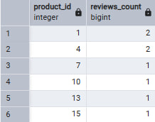
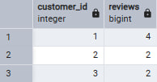
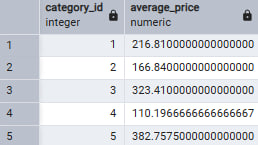
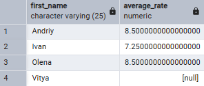
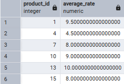
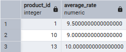
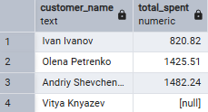
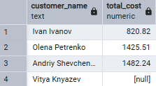
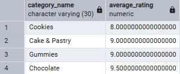

# Аналітичні SQL-запити (OLAP)

```sql
-- Кількість відгуків за продуктом
-- SELECT product_id, COUNT(*) AS reviews_count
-- FROM review
-- GROUP BY product_id 
-- ORDER BY product_id;

-- Кількість відгуків кожного користувача
-- SELECT customer_id, COUNT(*) AS reviews
-- FROM review
-- GROUP BY customer_id
-- ORDER BY customer_id;

-- Середня ціна продукту у кожній категорії
-- SELECT category_id, AVG(price) AS average_price
-- FROM product
-- GROUP BY category_id
-- ORDER BY category_id;

-- Середня оцінка кожного клієнта
-- SELECT c.first_name, AVG(r.rating) AS average_rate
-- FROM customer AS c
-- LEFT JOIN review AS r ON c.customer_id = r.customer_id
-- GROUP BY c.first_name
-- ORDER BY c.first_name;

-- Додаємо нові відгуки
-- INSERT INTO review (customer_id, product_id, review_comment, rating, review_date)
-- VALUES
-- (1, 1, 'Смакота!', 10, '2025-11-25'),
-- (1, 4, 'Взагалі не смачні цукерки.', 2, '2025-11-27');

-- Середня оцінка кожного продукту
-- SELECT r.product_id,AVG(r.rating) AS average_rate
-- FROM review AS r
-- LEFT JOIN product AS p ON p.product_id = r.product_id
-- GROUP BY r.product_id
-- ORDER BY r.product_id;

-- Показати товари, середня оцінка яких більше ніж 8
-- SELECT r.product_id,AVG(r.rating) AS average_rate
-- FROM review AS r
-- LEFT JOIN product AS p ON p.product_id = r.product_id
-- GROUP BY r.product_id
-- HAVING AVG(r.rating) > 8
-- ORDER BY r.product_id;

-- Показати всі витрачені кошти на замовлення у кожного користувача
-- SELECT c.first_name || ' ' || c.last_name AS customer_name,
-- SUM(oi.quantity * oi.unit_price) AS total_spent
-- FROM customer AS c
-- LEFT JOIN order_table AS ot ON c.customer_id = ot.customer_id
-- LEFT JOIN order_item AS oi ON ot.order_id = oi.order_id
-- GROUP BY c.customer_id
-- ORDER BY total_spent;

-- Показати суму товарів у корзині кожного користувача
-- SELECT c.first_name || ' ' || c.last_name AS customer_name,
-- SUM(ci.quantity * ci.unit_price) AS total_cost
-- FROM customer AS c
-- LEFT JOIN cart AS ct ON c.customer_id = ct.customer_id
-- LEFT JOIN cart_item AS ci ON ct.cart_id = ci.cart_id
-- GROUP BY c.customer_id
-- ORDER BY total_cost;

-- Середній рейтинг товарів за категоріями (тільки більше 7)
-- SELECT cg.category_name, AVG(r.rating) AS average_rating
-- FROM category AS cg
-- LEFT JOIN product AS p ON cg.category_id = p.category_id
-- LEFT JOIN review AS r ON r.product_id = p.product_id
-- GROUP BY cg.category_name
-- HAVING AVG(r.rating) > 7
-- ORDER BY average_rating;
```

### **Пояснення (ціль) запиту вказана зверху над кожним запитом**

# **Зображення кожного запиту:**
---
## **Кількість відгуків за продуктом**

## **Кількість відгуків кожного користувача**

## **Середня ціна продукту у кожній категорії**

## **Середня оцінка кожного клієнта**

## **Середня оцінка кожного продукту**

## **Показати товари, середня оцінка яких більше ніж 8**

## **Показати всі витрачені кошти на замовлення у кожного користувача**

## **Показати суму товарів у корзині кожного користувача**

## **Середній рейтинг товарів за категоріями (тільки більше 7)**
