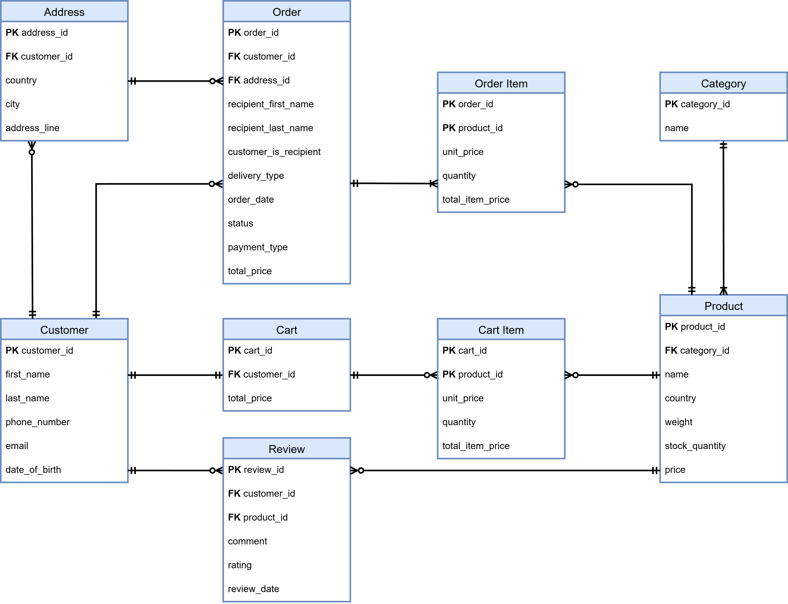
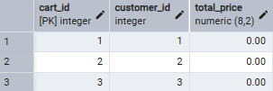
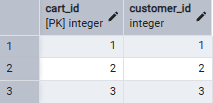
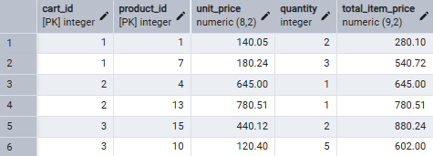
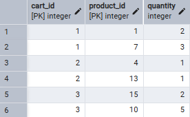
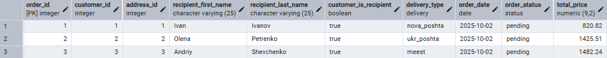
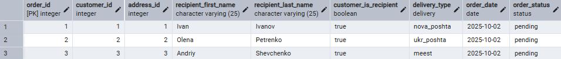
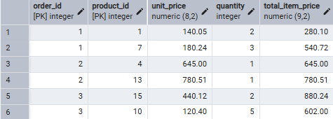
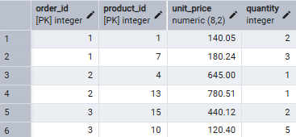
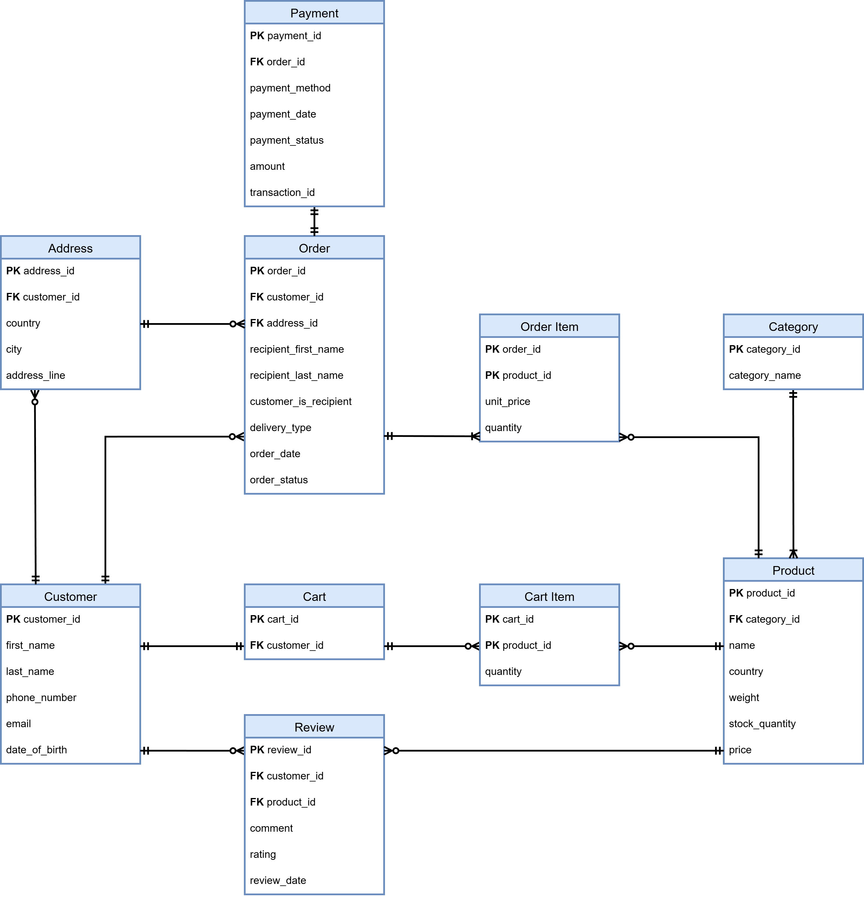

# **Нормалізація у PostgreSQL**

## **Початковий стан таблиць**
**Почнемо з огляду того, який вигляд та структуру мають таблиці нашої бази на момент початку виконання лабораторної роботи.**



**Розберемо кожну таблицю по черзі, та спробуємо визначити її форму нормалізації, функціональні залжності між її атрибутами.**

## **1. Customer**
**Форма нормалізації - 3NF**

**customer_id - PK**

**first_name <--- customer_id**

**last_name <--- customer_id**

**phone_number <--- customer_id**

**email <--- customer_id**

**date_of_birth <--- customer_id**

## **2. Address**
**Форма нормалізації - 3NF**

**address_id - PK**

**customer_id <--- address_id**   (Кожна адреса - окрема, у деяких користувачів може бути однакова адреса, але address_id буде різним)

**country <--- address_id**

**city <--- address_id**

**address_line <--- address_id**

## **3. Category**
**Форма нормалізації - 3NF**

**category_id - PK**

**category_name <--- category_id**


## **4. Product**
**Форма нормалізації - 3NF**

**product_id - PK**

**category_id <--- product_id**

**product_name <--- product_id**

**product_country <--- product_id**

**product_weight <--- product_id**

**stock_quantity <--- product_id**

**price <--- product_id**

## **5. Cart**
**Форма нормалізації - 2NF**
**cart_id - PK**

**customer_id <--- cart_id**

**total_price <--- (сума cart_item)** (Це транзитивна залежність, а отже це є некоректним для 3 нормальної форми)

**Для нормалізації до 3NF нам необхідно видалити лише атрибут total_price**

## **6. Cart Item**
**Форма нормалізації - 1NF**

**cart_id - PK**

**product_id - PK**

**unit_price <--- product_id** (Це некоректно для 2 нормальної форми, оскільки тут атрибут приймає залежність лише від частини сладенного ключа, також це є дублюванням інформації з таблиці Product)

**quantity <--- (cart_id, product_id)**

**total_item_price <--- product_id, quantity** (Це також некоректно, але вже для 3 нормальної форми)

**У подальшому для виправлення даної таблиці, нам необхідно буде видалити атрибути unit_price та total_item_price**

## **7. Order Table**
**Форма нормалізації - 2NF**

**order_id - PK**

**customer_id <--- order_id**

**address_id <--- order_id**

**recipient_first_name <--- order_id**

**recipient_last_name <--- order_id**

**customer_is_recipient <--- order_id**

**delivery_type <--- order_id**

**order_date <--- order_id**

**order_status <--- order_id**

**total_price <--- (сума order_item)** (Це транзитивна залежність, а отже це є некоректним для 3 нормальної форми)

**У подальшому для виправлення даної таблиці, нам необхідно буде видалити атрибут total_price**

## **8. Order Item**
**Форма нормалізації - 2NF**

**order_id - PK**

**product_id - PK**

**unit_price <--- (order_id, product_id)**

**quantity <--- (order_id, product_id)**

**total_item_price <--- unit_price, quantity** (Це транзитивна залежність, а отже це є некоректним для 3 нормальної форми)

**У даному випадку unit_price та quantity є коректними, оскільки залишають своє значення після створення замовлення, незважаючи на те як змінюється дане значення у таблицях Product та Cart. Для нормалізації нам необхідно буде видалити лише атрибут total_item_price.**

## **9. Payment**
**Форма нормалізації - 3NF**

**payment_id - PK**

**order_id <--- payment_id**

**payment_method <--- payment_id**

**payment_date <--- payment_id**

**payment_status <--- payment_id**

**amount <--- payment_id**

**transaction_id <--- payment_id**

## **10. Review**
**Форма нормалізації - 3NF**

**review_id - PK**

**customer_id <--- review_id**

**product_id <--- review_id**

**comment <--- review_id**

**rating <--- review_id**

**review_date <--- review_id**

# **Нормалізація**

**Отже, наступним кроком є вирішення всіх зауважень, які ми виявили при аналізі поточної архітектури бази даних.**

## **Cart**
**Старий вигляд таблиці:**



**Новий вигляд таблиці:**



**Запит для нормалізації таблиці:**

```sql
ALTER TABLE cart
DROP COLUMN total_price;
```

## **Cart Item**
**Старий вигляд таблиці:**



**Новий вигляд таблиці:**



**Запит для нормалізації таблиці:**

```sql
ALTER TABLE cart_item
DROP COLUMN total_item_price;
ALTER TABLE cart_item
DROP COLUMN unit_price;
```

## **Order Table**
**Старий вигляд таблиці:**



**Новий вигляд таблиці:**



**Запит для нормалізації таблиці:**

```sql
ALTER TABLE order_table
DROP COLUMN total_price;
```

## **Order Item**
**Старий вигляд таблиці:**



**Новий вигляд таблиці:**



**Запит для нормалізації таблиці:**

```sql
ALTER TABLE order_item
DROP COLUMN total_item_price;
```

# **Новий вигляд ER діаграми**
