# **Schema Migrations with Prisma**

## **Схема при першому виклику "npx prisma db pull"**
```
generator client {
  provider = "prisma-client"
  output   = "../generated/prisma"
}

datasource db {
  provider = "postgresql"
  url      = env("DATABASE_URL")
}

model address {
  address_id         Int           @id @default(autoincrement())
  customer_id        Int
  country            String        @db.VarChar(70)
  city               String        @db.VarChar(200)
  address_line       String        @db.VarChar(400)
  address_is_default Boolean       @default(false)
  customer           customer      @relation(fields: [customer_id], references: [customer_id], onDelete: NoAction, onUpdate: NoAction)
  order_table        order_table[]
}

model cart {
  cart_id     Int         @id @default(autoincrement())
  customer_id Int
  customer    customer    @relation(fields: [customer_id], references: [customer_id], onDelete: NoAction, onUpdate: NoAction)
  cart_item   cart_item[]
}

/// This table contains check constraints and requires additional setup for migrations. Visit https://pris.ly/d/check-constraints for more info.
model cart_item {
  cart_id    Int
  product_id Int
  quantity   Int
  cart       cart    @relation(fields: [cart_id], references: [cart_id], onDelete: NoAction, onUpdate: NoAction)
  product    product @relation(fields: [product_id], references: [product_id], onDelete: NoAction, onUpdate: NoAction)

  @@id([cart_id, product_id])
}

model category {
  category_id   Int       @id @default(autoincrement())
  category_name String    @db.VarChar(30)
  product       product[]
}

/// This table contains check constraints and requires additional setup for migrations. Visit https://pris.ly/d/check-constraints for more info.
model customer {
  customer_id   Int           @id @default(autoincrement())
  first_name    String        @db.VarChar(25)
  last_name     String        @db.VarChar(25)
  phone_number  String        @unique @db.VarChar(13)
  email         String        @unique @db.VarChar(60)
  date_of_birth DateTime      @db.Date
  address       address[]
  cart          cart[]
  order_table   order_table[]
  review        review[]
}

/// This table contains check constraints and requires additional setup for migrations. Visit https://pris.ly/d/check-constraints for more info.
model order_item {
  order_id    Int
  product_id  Int
  unit_price  Decimal     @db.Decimal(8, 2)
  quantity    Int
  order_table order_table @relation(fields: [order_id], references: [order_id], onDelete: NoAction, onUpdate: NoAction)
  product     product     @relation(fields: [product_id], references: [product_id], onDelete: NoAction, onUpdate: NoAction)

  @@id([order_id, product_id])
}

model order_table {
  order_id              Int          @id @default(autoincrement())
  customer_id           Int
  address_id            Int
  recipient_first_name  String       @db.VarChar(25)
  recipient_last_name   String       @db.VarChar(25)
  customer_is_recipient Boolean      @default(false)
  delivery_type         delivery     @default(nova_poshta)
  order_date            DateTime     @default(dbgenerated("CURRENT_DATE")) @db.Date
  order_status          status       @default(pending)
  order_item            order_item[]
  address               address      @relation(fields: [address_id], references: [address_id], onDelete: NoAction, onUpdate: NoAction)
  customer              customer     @relation(fields: [customer_id], references: [customer_id], onDelete: NoAction, onUpdate: NoAction)
  payment               payment[]
}

/// This table contains check constraints and requires additional setup for migrations. Visit https://pris.ly/d/check-constraints for more info.
model payment {
  payment_id     Int          @id @default(autoincrement())
  order_id       Int
  payment_method payment_type
  payment_date   DateTime     @db.Date
  payment_status status
  amount         Decimal      @db.Decimal(9, 2)
  transaction_id String       @db.VarChar(400)
  order_table    order_table  @relation(fields: [order_id], references: [order_id], onDelete: NoAction, onUpdate: NoAction)
}

/// This table contains check constraints and requires additional setup for migrations. Visit https://pris.ly/d/check-constraints for more info.
model product {
  product_id      Int          @id @default(autoincrement())
  category_id     Int
  product_name    String       @db.VarChar(200)
  product_country String       @db.VarChar(70)
  weight          Decimal      @db.Decimal(5, 3)
  stock_quantity  Int
  price           Decimal      @db.Decimal(8, 2)
  cart_item       cart_item[]
  order_item      order_item[]
  category        category     @relation(fields: [category_id], references: [category_id], onDelete: NoAction, onUpdate: NoAction)
  review          review[]
}

/// This table contains check constraints and requires additional setup for migrations. Visit https://pris.ly/d/check-constraints for more info.
model review {
  review_id      Int      @id @default(autoincrement())
  customer_id    Int
  product_id     Int
  review_comment String   @db.VarChar(350)
  rating         Int
  review_date    DateTime @default(dbgenerated("CURRENT_DATE")) @db.Date
  customer       customer @relation(fields: [customer_id], references: [customer_id], onDelete: NoAction, onUpdate: NoAction)
  product        product  @relation(fields: [product_id], references: [product_id], onDelete: NoAction, onUpdate: NoAction)
}

enum delivery {
  nova_poshta
  ukr_poshta
  meest
}

enum payment_type {
  card
  paypal
  apple_pay
  google_pay
}

enum status {
  pending
  success
  failed
  refunded
}
```

## **Далі було створено дві міграції, перша для додавання нової таблиці Shipping (доставка), та друга для зміни існуючих таблиць Order_table та Shipping, з додаванням зв'язку між ними.**

## **Схема після обох міграцій**
```
generator client {
  provider = "prisma-client"
  output   = "../generated/prisma"
}

datasource db {
  provider = "postgresql"
  url      = env("DATABASE_URL")
}

model address {
  address_id         Int           @id @default(autoincrement())
  customer_id        Int
  country            String        @db.VarChar(70)
  city               String        @db.VarChar(200)
  address_line       String        @db.VarChar(400)
  address_is_default Boolean       @default(false)
  customer           customer      @relation(fields: [customer_id], references: [customer_id], onDelete: NoAction, onUpdate: NoAction)
  order_table        order_table[]
}

model cart {
  cart_id     Int         @id @default(autoincrement())
  customer_id Int
  customer    customer    @relation(fields: [customer_id], references: [customer_id], onDelete: NoAction, onUpdate: NoAction)
  cart_item   cart_item[]
}

/// This table contains check constraints and requires additional setup for migrations. Visit https://pris.ly/d/check-constraints for more info.
model cart_item {
  cart_id    Int
  product_id Int
  quantity   Int
  cart       cart    @relation(fields: [cart_id], references: [cart_id], onDelete: NoAction, onUpdate: NoAction)
  product    product @relation(fields: [product_id], references: [product_id], onDelete: NoAction, onUpdate: NoAction)

  @@id([cart_id, product_id])
}

model category {
  category_id   Int       @id @default(autoincrement())
  category_name String    @db.VarChar(30)
  product       product[]
}

/// This table contains check constraints and requires additional setup for migrations. Visit https://pris.ly/d/check-constraints for more info.
model customer {
  customer_id   Int           @id @default(autoincrement())
  first_name    String        @db.VarChar(25)
  last_name     String        @db.VarChar(25)
  phone_number  String        @unique @db.VarChar(13)
  email         String        @unique @db.VarChar(60)
  date_of_birth DateTime      @db.Date
  address       address[]
  cart          cart[]
  order_table   order_table[]
  review        review[]
}

/// This table contains check constraints and requires additional setup for migrations. Visit https://pris.ly/d/check-constraints for more info.
model order_item {
  order_id    Int
  product_id  Int
  unit_price  Decimal     @db.Decimal(8, 2)
  quantity    Int
  order_table order_table @relation(fields: [order_id], references: [order_id], onDelete: NoAction, onUpdate: NoAction)
  product     product     @relation(fields: [product_id], references: [product_id], onDelete: NoAction, onUpdate: NoAction)

  @@id([order_id, product_id])
}

model order_table {
  order_id              Int          @id @default(autoincrement())
  customer_id           Int
  address_id            Int
  recipient_first_name  String       @db.VarChar(25)
  recipient_last_name   String       @db.VarChar(25)
  customer_is_recipient Boolean      @default(false)
  delivery_type         delivery     @default(nova_poshta)
  order_date            DateTime     @default(dbgenerated("CURRENT_DATE")) @db.Date
  order_status          status       @default(pending)
  shipping              Shipping?
  order_item            order_item[]
  address               address      @relation(fields: [address_id], references: [address_id], onDelete: NoAction, onUpdate: NoAction)
  customer              customer     @relation(fields: [customer_id], references: [customer_id], onDelete: NoAction, onUpdate: NoAction)
  payment               payment[]
}

/// This table contains check constraints and requires additional setup for migrations. Visit https://pris.ly/d/check-constraints for more info.
model payment {
  payment_id     Int          @id @default(autoincrement())
  order_id       Int
  payment_method payment_type
  payment_date   DateTime     @db.Date
  payment_status status
  amount         Decimal      @db.Decimal(9, 2)
  transaction_id String       @db.VarChar(400)
  order_table    order_table  @relation(fields: [order_id], references: [order_id], onDelete: NoAction, onUpdate: NoAction)
}

/// This table contains check constraints and requires additional setup for migrations. Visit https://pris.ly/d/check-constraints for more info.
model product {
  product_id      Int          @id @default(autoincrement())
  category_id     Int
  product_name    String       @db.VarChar(200)
  product_country String       @db.VarChar(70)
  weight          Decimal      @db.Decimal(5, 3)
  stock_quantity  Int
  price           Decimal      @db.Decimal(8, 2)
  cart_item       cart_item[]
  order_item      order_item[]
  category        category     @relation(fields: [category_id], references: [category_id], onDelete: NoAction, onUpdate: NoAction)
  review          review[]
}

/// This table contains check constraints and requires additional setup for migrations. Visit https://pris.ly/d/check-constraints for more info.
model review {
  review_id      Int      @id @default(autoincrement())
  customer_id    Int
  product_id     Int
  review_comment String   @db.VarChar(350)
  rating         Int
  review_date    DateTime @default(dbgenerated("CURRENT_DATE")) @db.Date
  customer       customer @relation(fields: [customer_id], references: [customer_id], onDelete: NoAction, onUpdate: NoAction)
  product        product  @relation(fields: [product_id], references: [product_id], onDelete: NoAction, onUpdate: NoAction)
}

model Shipping {
  shipping_id   Int         @id @default(autoincrement())
  tracking_code String?     @db.VarChar(200)
  order_id      Int         @unique
  order_table   order_table @relation(fields: [order_id], references: [order_id], onDelete: NoAction, onUpdate: NoAction)
}

enum delivery {
  nova_poshta
  ukr_poshta
  meest
}

enum payment_type {
  card
  paypal
  apple_pay
  google_pay
}

enum status {
  pending
  success
  failed
  refunded
}
```

# **Зображення заповнених даними таблиць у Prisma Studio**

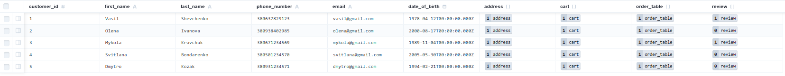

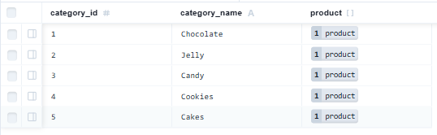

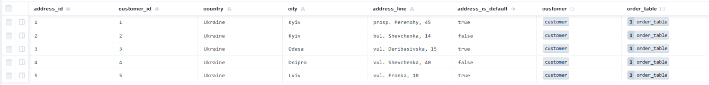

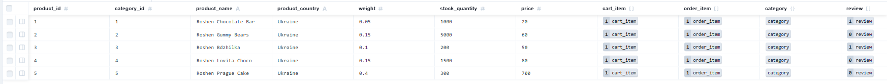

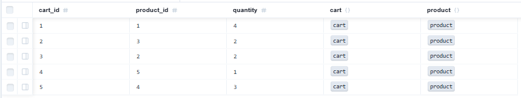

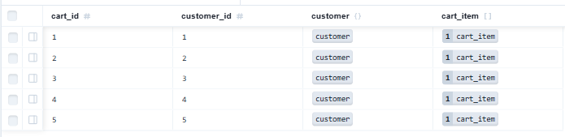

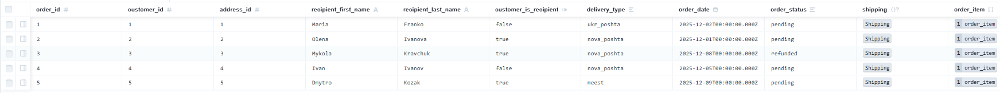

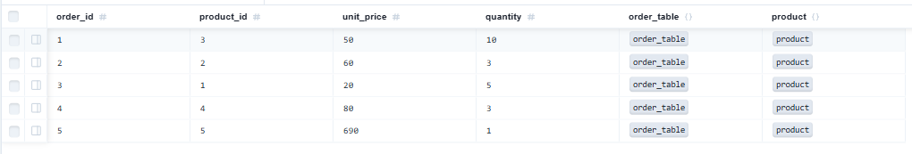

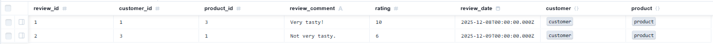

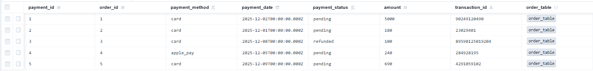

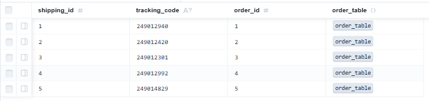

## **Отже, у цій лабораторній роботі мені довелося знайомитись з новою для мене ORM, а саме Prisma. Мені було цікаво розібратись у даній ORM, вона здалася мені дуже зручною та легкою у використанні.**